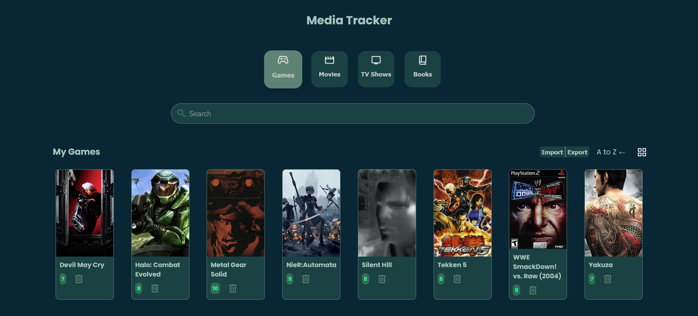
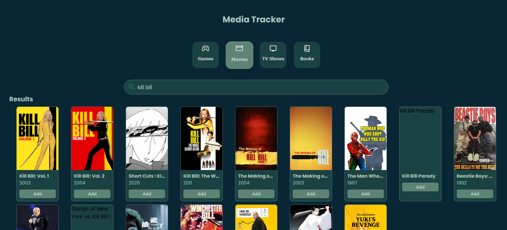

# Media Tracker App

A single-page React application to search, track, and rate movies, TV shows, games, and books. Users can build a personal media library, manage ratings, and import/export their data as JSON.

---

## Screenshots

### Library View


### Search Results


## Features

- Category-based search (Movies, TV Shows, Games, Books)
- API-powered search results with normalized data
- Add and remove items from a personal library
- Rate library items (1–10) with inline editing
- Sort library items
- Import and export library data as JSON
- Responsive, card-based UI

---

## Tech Stack

- **Frontend:** React (functional components, hooks)
- **Styling:** CSS (Flexbox / Grid)
- **APIs:** TMDB, RAWG, Open Library
- **State Management:** React state & props
- **Data Handling:** Client-side JSON import/export

---

## Getting Started

```bash
git clone https://github.com/sharjh/react-media-tracker
cd react-media-tracker
npm install
npm run dev
```

## Credits

- Fonts and icons provided by [Google Fonts](https://fonts.google.com)
- Movie and TV data from [The Movie Database (TMDB)](https://www.themoviedb.org)
- Game data from [RAWG Video Games Database](https://rawg.io)
- Book data from [Google Books](https://books.google.com/)